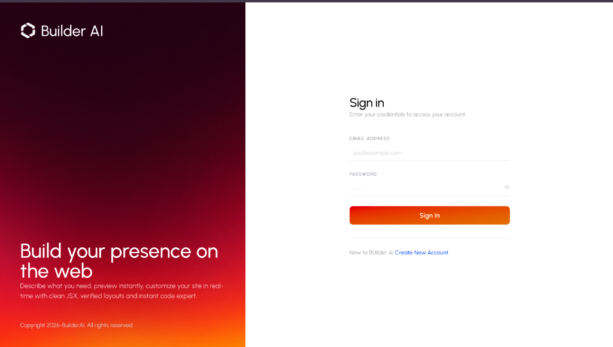
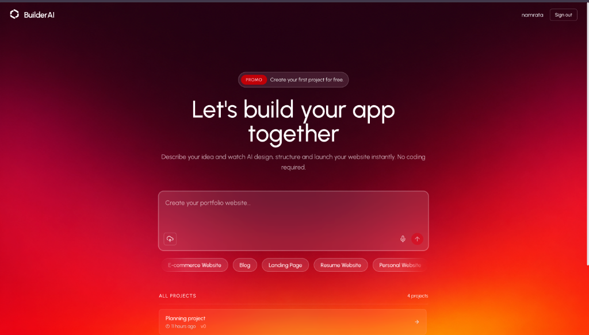

# 🚀 Builder AI — Full-Stack AI Website Generator

**Builder AI** is an elite, full-stack MERN application that turns natural language prompts into production-ready, visually stunning React web applications in seconds. Powered by OpenRouter AI models, Sandpack in-browser compilation, and full-stack session management, it offers a complete v0 / Bolt.new alternative for instantaneous web design and live prototyping.

---

## 📸 Screenshots & Showcase

### 🔐 Login & User Authentication


### 💻 AI Workspace & Live Interactive Sandbox Preview


---

## ✨ Key Features

- **⚡ AI Multi-File Architecture Planning**: Automatically generates file structure plans (`/App.js`, `/styles.css`, `/components/*`) tailored for marketing sites, agency portfolios, games, or interactive web applications.
- **💻 Real-Time In-Browser Execution**: Integrated with `@codesandbox/sandpack-react` to compile and render live React code directly in the browser with instant hot-reloading and active file watching.
- **🔄 Conversational Code Revisions**: Iteratively revise, edit, or extend your generated projects through chat prompts using structured JSON diff search/replace operations.
- **🛡️ Intelligent Code Sanitizer & Auto-Fixer**: Built-in post-generation validator that automatically fixes unclosed void elements (`<input />`), resolves relative import paths, fixes JSX quote escaping, and strips incompatible TypeScript syntax.
- **📦 One-Click Zip Export**: Download your complete React source code bundled in a `.zip` archive ready to run locally with `npm install && npm run dev`.
- **🌐 Instant Web Publishing**: Publish projects publicly with a single click to share live working previews via shareable URL routes.
- **🔒 Cross-Domain Authentication**: Secure JWT session handling supporting HTTP-only cookies (`SameSite=None`) and Authorization headers across separate deployments (e.g. Vercel + Render).

---

## 🛠️ Tech Stack

### **Frontend (`/client`)**
- **Core Framework**: React 19, Vite 8
- **Styling**: Tailwind CSS v4, Font Awesome 6
- **Code Execution**: `@codesandbox/sandpack-react`
- **Routing**: `react-router-dom` v7
- **Icons & UI**: `lucide-react`, `react-hot-toast`
- **Export Utility**: `jszip`, `file-saver`

### **Backend (`/server`)**
- **Runtime**: Node.js, Express.js
- **Database**: MongoDB with Mongoose ODM
- **AI Engine**: `@ai-sdk/openai`, OpenRouter API (`openrouter/free` / `gemini-2.0-flash`)
- **Schema Validation**: Zod (`FilePlanSchema`, `FileCodeSchema`, `RevisionResultSchema`)
- **Concurrency & Rate Limit Control**: `p-map`
- **Security & Session**: JSON Web Tokens (`jsonwebtoken`), `cookie-parser`, `cors`, `bcryptjs`

---

## 📂 Project Directory Structure

```
builder-ai/
├── client/                      # React Frontend Application
│   ├── public/
│   │   └── assets/              # Static assets & screenshots
│   ├── src/
│   │   ├── api/                 # Axios instance with BASE_URL config
│   │   ├── components/          # UI Components (Header, FileExplorer, PreviewPanel, ChatPanel, etc.)
│   │   ├── context/             # AppContext for global project & auth state
│   │   ├── pages/               # AuthPage, BuilderPage, HomePages, PreviewPage, PublishPage
│   │   └── utils/               # Export utilities & Sandpack helper sanitizers
│   ├── .env                     # Client Environment Variables
│   ├── vercel.json              # Vercel SPA Routing Configuration
│   └── package.json
│
├── server/                      # Node.js Express Backend API
│   ├── config/                  # MongoDB Connection setup
│   ├── controllers/             # authController, projectController
│   ├── middleware/              # JWT Auth Middleware
│   ├── models/                  # UserSchema, ProjectSchema
│   ├── routes/                  # Auth & Project API Routes
│   ├── services/
│   │   ├── ai.js                # OpenRouter generateProject & reviseProject logic
│   │   ├── codeValidator.js     # Post-generation code auto-fixer
│   │   ├── contentNormalizer.js # Content string escape normalizer
│   │   └── prompts.js           # Centralized system prompts & styling rules
│   ├── .env                     # Server Environment Variables
│   ├── index.js                 # Express App entry point
│   └── package.json
│
├── docs/
│   └── images/                  # Mockup images for documentation
└── README.md
```

---

## 🚀 Getting Started

### Prerequisites
Make sure you have the following installed locally:
- **Node.js**: v18.0.0 or higher
- **npm**: v9.0.0 or higher
- **MongoDB**: A local instance or [MongoDB Atlas](https://www.mongodb.com/cloud/atlas) cluster
- **OpenRouter API Key**: Obtain a free API key from [OpenRouter.ai](https://openrouter.ai/)

---

### Step 1: Clone the Repository

```bash
git clone https://github.com/30namrata/builder-ai.git
cd builder-ai
```

---

### Step 2: Configure Environment Variables

#### **Server Environment (`server/.env`)**
Create a `.env` file in the `server` directory:

```env
PORT=3000
MONGO_URI=mongodb+srv://<username>:<password>@cluster.mongodb.net/builder-ai?retryWrites=true&w=majority
SECRET_KEY=your_super_secret_jwt_key_here
OPENROUTER_API_KEY=sk-or-v1-your-openrouter-api-key-here
OPENROUTER_MODEL=openrouter/free
AI_MAX_CONCURRENCY=2
ORIGINS=http://localhost:5173,http://localhost:3000
```

#### **Client Environment (`client/.env`)**
Create a `.env` file in the `client` directory:

```env
VITE_BASE_URL=http://localhost:3000
```

---

### Step 3: Install Dependencies

#### Install Server Dependencies:
```bash
cd server
npm install
```

#### Install Client Dependencies:
```bash
cd ../client
npm install
```

---

### Step 4: Run Development Servers

#### **Start Backend Server:**
```bash
cd server
npm run dev
```
*Server will start running at `http://localhost:3000`*

#### **Start Frontend Client:**
```bash
cd client
npm run dev
```
*Client will open at `http://localhost:5173`*

---

## 📡 API Endpoint Reference

| Method | Endpoint | Description | Auth Required |
| :--- | :--- | :--- | :---: |
| `POST` | `/api/auth/register` | Register a new user account | ❌ |
| `POST` | `/api/auth/login` | Authenticate user & set JWT session cookie | ❌ |
| `POST` | `/api/auth/logout` | Clear session cookie | ❌ |
| `GET` | `/api/auth/me` | Fetch authenticated user profile | ✅ |
| `GET` | `/api/projects` | List all projects owned by authenticated user | ✅ |
| `POST` | `/api/projects` | Create project & start background AI generation | ✅ |
| `GET` | `/api/projects/:id` | Fetch project details, messages, and file contents | ✅ |
| `PUT` | `/api/projects/:id/files` | Update project files (code editor sync) | ✅ |
| `POST` | `/api/projects/:id/publish` | Toggle public publishing status for a project | ✅ |
| `GET` | `/api/projects/public/:id` | Fetch public published project files | ❌ |

---

## 🤝 Contributing

Contributions are welcome! Please feel free to open an issue or submit a pull request:
1. Fork the Project
2. Create your Feature Branch (`git checkout -b feature/AmazingFeature`)
3. Commit your Changes (`git commit -m 'Add some AmazingFeature'`)
4. Push to the Branch (`git checkout -b feature/AmazingFeature`)
5. Open a Pull Request

---

## 📄 License

Distributed under the MIT License. See `LICENSE` for more information.
